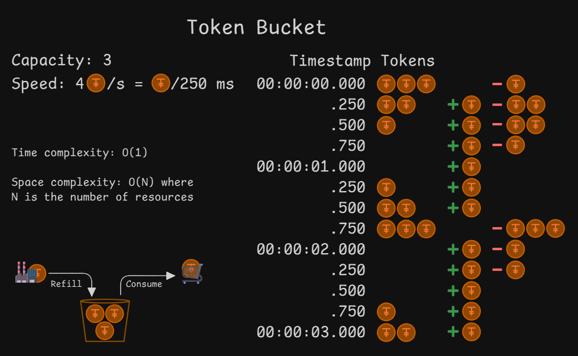
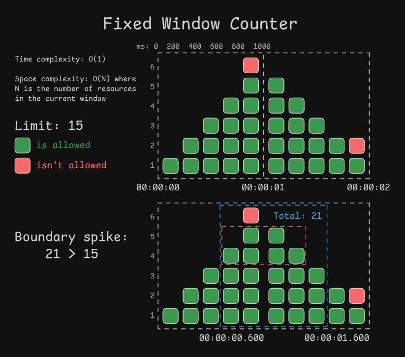
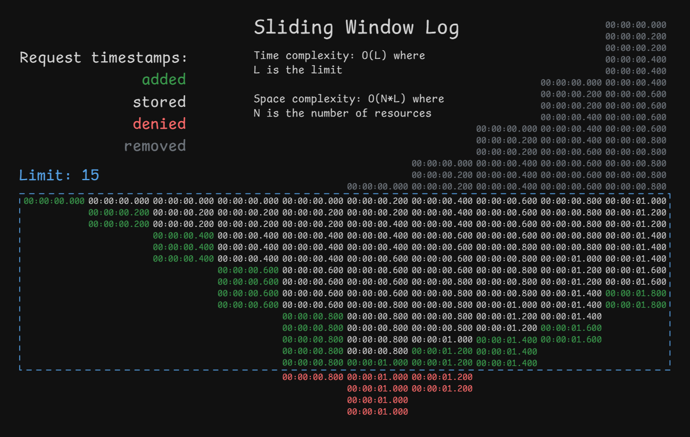
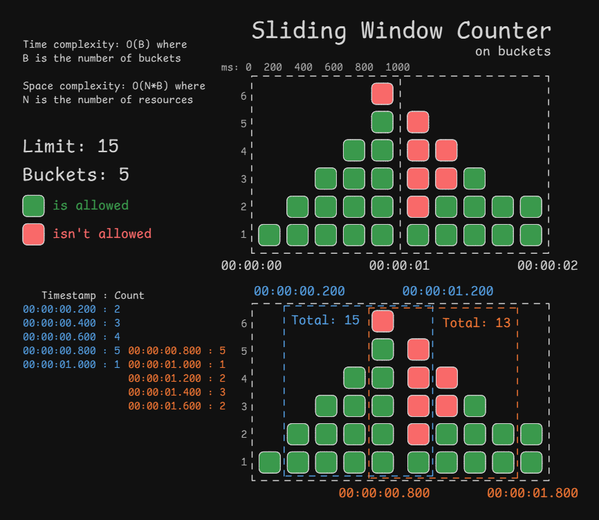
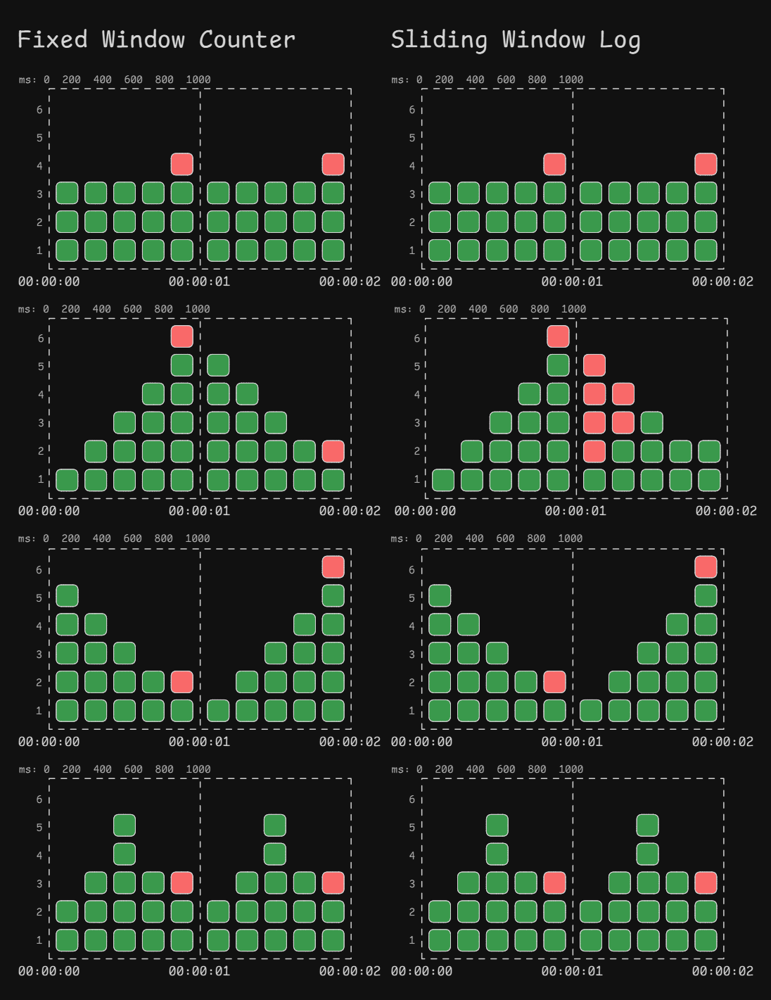
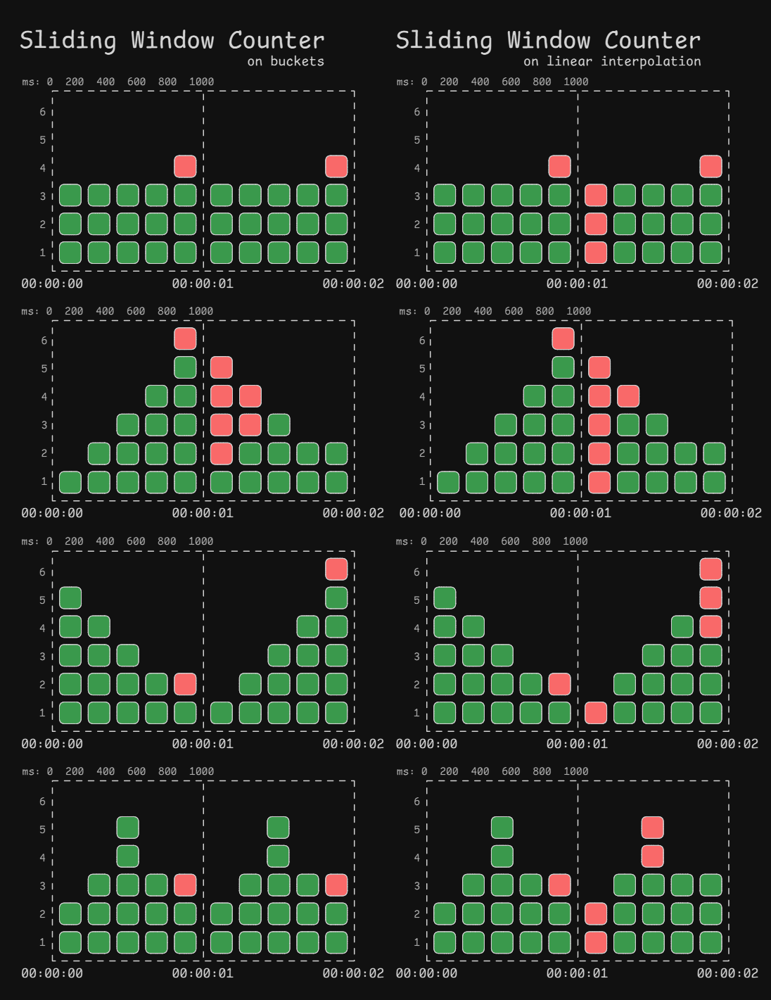

# Rate Limiter

## DIY

### Based on Bucket

#### Token Bucket

[See implementation](diy/src/main/java/io/github/tech0ver/ratelimiter/bucket/TokenBucketRateLimiter.java).

### Based on Window

#### Fixed Window Counter

[See implementation](diy/src/main/java/io/github/tech0ver/ratelimiter/window/FixedWindowCounterRateLimiter.java).

#### Sliding Window Log

[See implementation](diy/src/main/java/io/github/tech0ver/ratelimiter/window/SlidingWindowLogRateLimiter.java).

#### Sliding Window Counter

[See implementation](diy/src/main/java/io/github/tech0ver/ratelimiter/window/SlidingWindowCounterRateLimiter.java).

##### Based on buckets

##### Based on linear interpolation

#### Comparison

